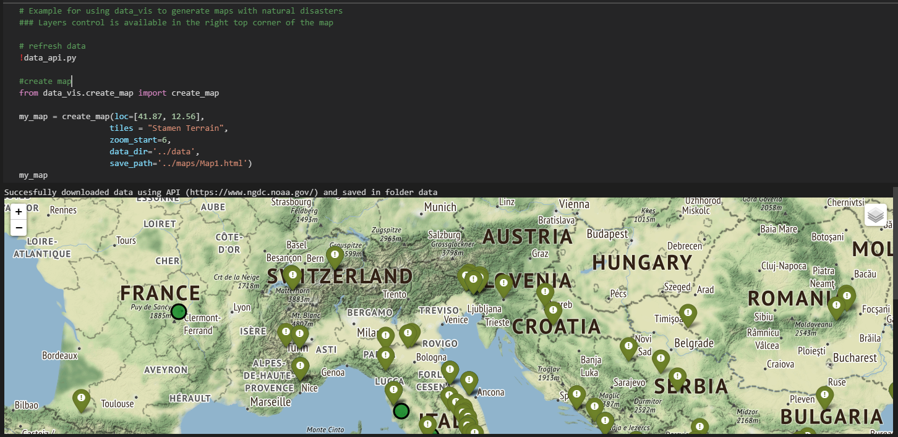
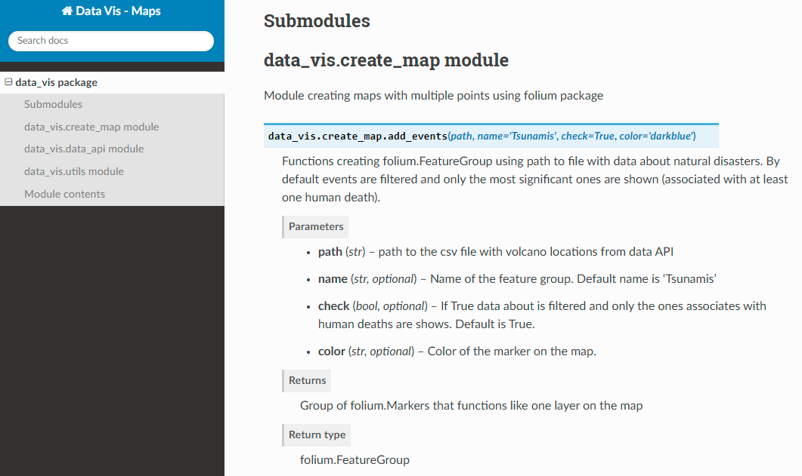

# Data_Vis_Map
Data Visualization - Generate Maps of Tsunamis, Earthquakes and Volcanos

Python scripts that automatically generate html files with maps that shows natural disasters.  
Data with recent earthquakes, tsunamis and volcano erruptions can be refreshed using data_api.py module.

# How to use
You can see example of how to use these scripts in the notebook Example.ipynb  
https://github.com/MagdaW19/Data_Vis_Map/blob/master/data_vis/Example.ipynb  

# Documentation
Documentation for all the modules is available:  
https://magdaw19.github.io/Data_Vis_Map/  

